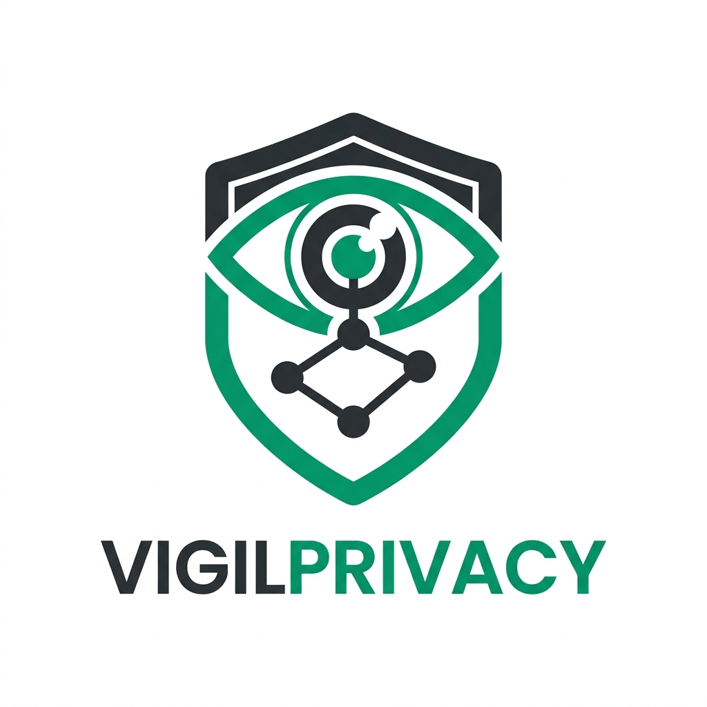

# VigilPrivacy: Privacy & Compliance Portal

VigilPrivacy is a premium, state-of-the-art Privacy and Compliance management platform designed to help organizations streamline their data protection workflows. Built with a focus on modern aesthetics and high-performance data visualization, it enables seamless management of RoPA, Assessments, and Data Mappings.



## 🚀 Features

### 📊 Comprehensive Dashboard
- **Dynamic Analytics**: Real-time visualization of compliance scores, assessment trends, and data transfer risks.
- **Assessment Trends**: Comparative line charts for LIA, DPIA, and TIA progress over the calendar year.
- **Activity Feed**: Live audit trail of organizational changes.

### 📋 RoPA Management
- Centralized repository for Record of Processing Activities.
- Advanced filtering and export capabilities.
- Intelligent stage tracking for lifecycle management.

### 🛡️ Privacy Assessments
- **Integrated Frameworks**: Dedicated modules for DPIA (Data Protection Impact Assessment), LIA (Legitimate Interest Assessment), and TIA (Transfer Impact Assessment).
- **Risk Scoring**: Automated calculation of risk levels based on impact and likelihood.

### 🗺️ Data Mapping & Flows
- **Visual Flow Builder**: Create complex data flow diagrams using an interactive canvas.
- **Transfer Tracking**: Monitor cross-border data transfers and regional compliance.

### 📚 Privacy Hub
- Knowledge base with professional articles and best practices.
- Multi-language support (English, Hindi, Sanskrit, Telugu).

## 🛠️ Tech Stack

- **Frontend**: React.js with Vite
- **Styling**: Vanilla CSS with modern utility patterns
- **Charts**: Chart.js / react-chartjs-2
- **Animations**: Framer Motion
- **Icons**: Lucide React
- **Internationalization**: i18next

## 📥 Getting Started

### Prerequisites
- Node.js (v18+)
- npm or yarn

### Installation
1. Clone the repository:
   ```bash
   git clone <repository-url>
   cd VigilPrivacy
   ```

2. Install dependencies:
   ```bash
   npm install
   ```

3. Start the development server:
   ```bash
   npm run dev
   ```

4. Build for production:
   ```bash
   npm run build
   ```

## 🧪 Mock API Layer
The application includes a high-fidelity **Mock API Service** located in `src/utils/mockData.js`. This allows for a fully functional demonstration of the dashboard, data mappings, and assessment workflows without requiring a live backend.

## ⚖️ License
Licensed under the MIT License. See `T&C.jsx` for detailed terms of service.

---
*Vigilance in Privacy, Excellence in Compliance.*
